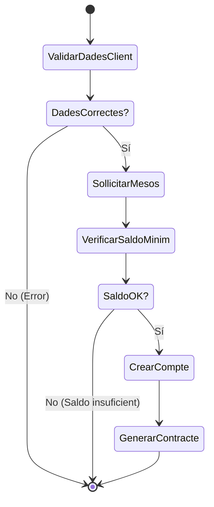

# Diagrama d'Activitat: Obrir Compte a Termini

```mermaid
stateDiagram-v2
    [*] --> ValidarDadesClient
    ValidarDadesClient --> DadesCorrectes?
    DadesCorrectes? --> SollicitarMesos : Sí
    DadesCorrectes? --> [*] : No (Error)
    SollicitarMesos --> VerificarSaldoMinim
    VerificarSaldoMinim --> SaldoOK?
    SaldoOK? --> CrearCompte : Sí
    SaldoOK? --> [*] : No (Saldo insuficient)
    CrearCompte --> GenerarContracte
    GenerarContracte --> [*]
```
