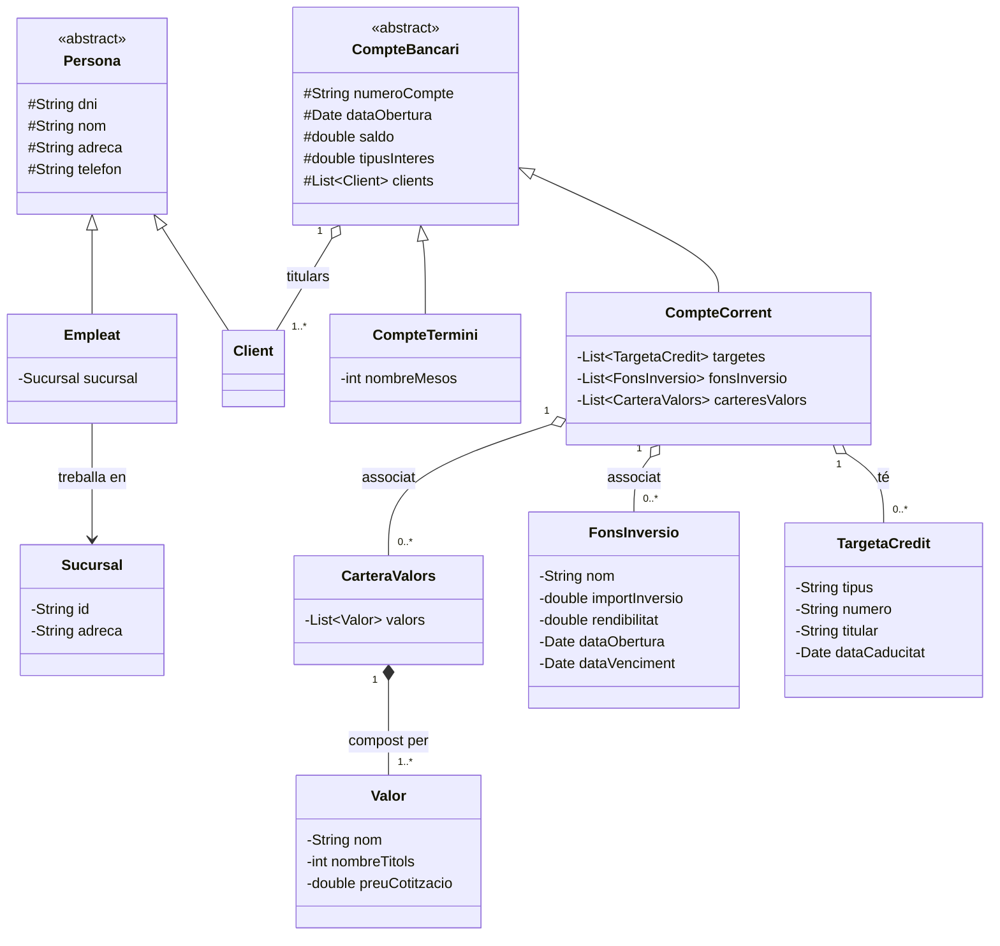

# Diagrama de Classes - Gestió Bancària

## Justificació del Disseny
1. **Herència**: S'ha utilitzat una classe abstracta `Persona` per evitar duplicitat entre `Client` i `Empleat`. De la mateixa manera, `CompteBancari` és abstracta ja que tot compte ha de ser o bé `Corrent` o `A Termini`.
2. **Associació**: Els comptes tenen una llista de clients (titulars).
3. **Agregació**: Un compte corrent pot tenir targetes o fons, però aquests poden existir (o el compte pot no tenir-ne cap).
4. **Composició**: La `CarteraValors` està composta per `Valor`. Si s'elimina la cartera, els valors associats a aquesta instància específica perden el seu context dins del compte.
