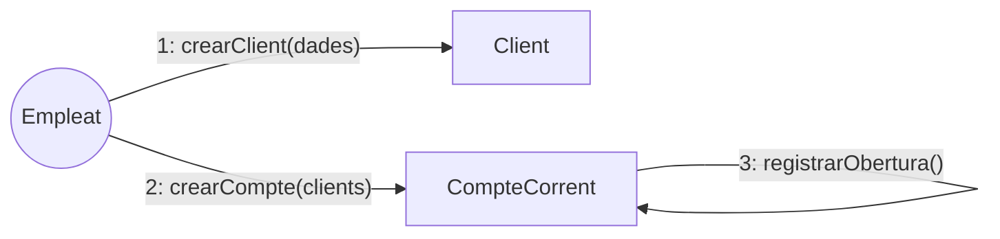

# Diagrama de Comunicació: Obertura de Compte

```mermaid
flowchart LR
    E((Empleat)) -- "1: crearClient(dades)" --> C[Client]
    E -- "2: crearCompte(clients)" --> CC[CompteCorrent]
    CC -- "3: registrarObertura()" --> CC
```
