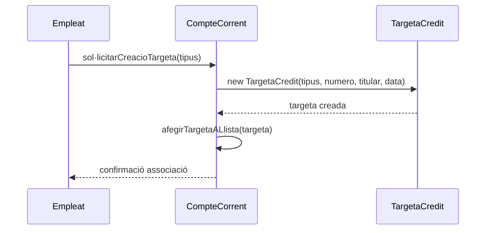

# Diagrama de Seqüència: Associar Targeta

```mermaid
sequenceDiagram
    participant E as Empleat
    participant CC as CompteCorrent
    participant T as TargetaCredit

    E->>CC: sol·licitarCreacioTargeta(tipus)
    CC->>T: new TargetaCredit(tipus, numero, titular, data)
    T-->>CC: targeta creada
    CC->>CC: afegirTargetaALlista(targeta)
    CC-->>E: confirmació associació
```
